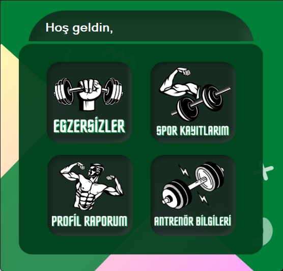
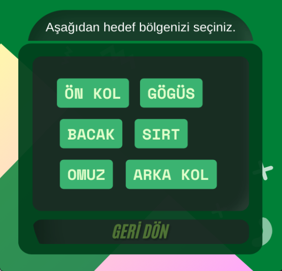
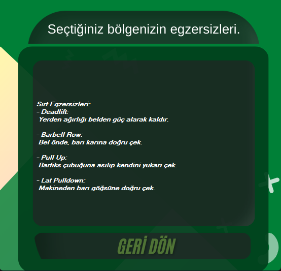
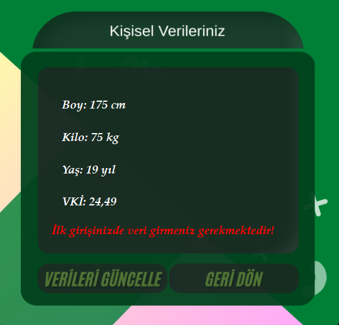
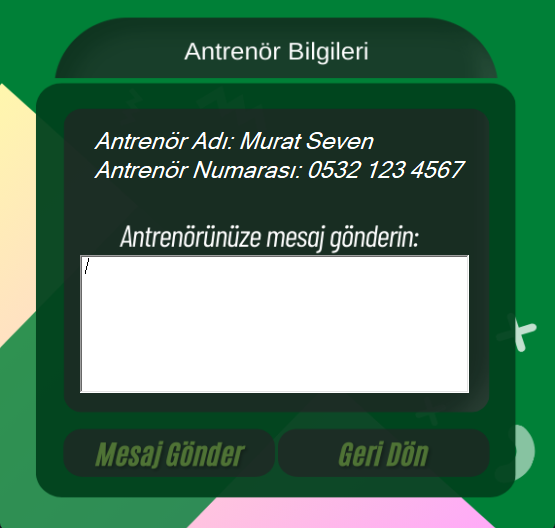

# 🏅 Spor Takip Uygulaması

Bu proje, **C# Windows Forms** kullanılarak geliştirilmiş bir **Spor Takip Uygulaması** uygulamasıdır. Kullanıcılar, spor aktivitelerini takip edebilir, egzersiz geçmişlerini görüntüleyebilir ve yeni aktiviteler ekleyebilir. Proje eğitim amaçlıdır.

## 🧩 Özellikler

- Spor aktivitelerini listeleme
- Egzersiz geçmişini görüntüleme
- Yeni spor aktiviteleri ekleyebilme
- Basit ve kullanıcı dostu arayüz

## 🛠️ Kullanılan Teknolojiler

- C# (Windows Forms)
- .NET Framework
- Visual Studio
- (Opsiyonel: JSON, XML ya da SQL Server ile veri saklama)

## 🖼️ Uygulama İçi Ekran Görüntüleri

